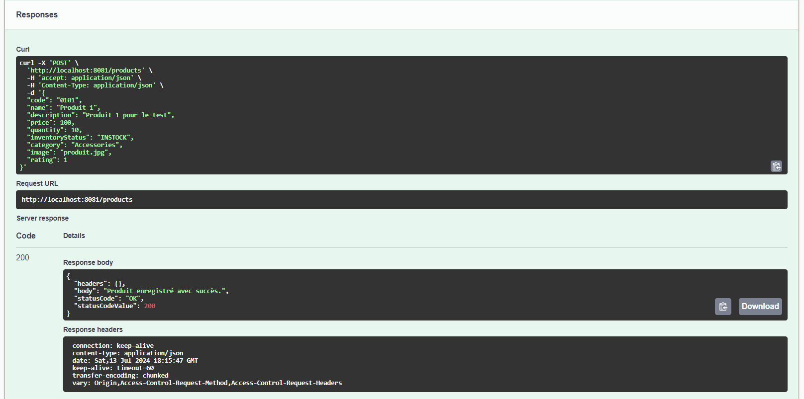
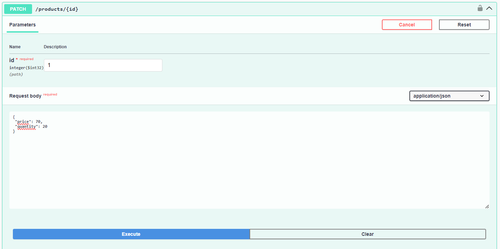
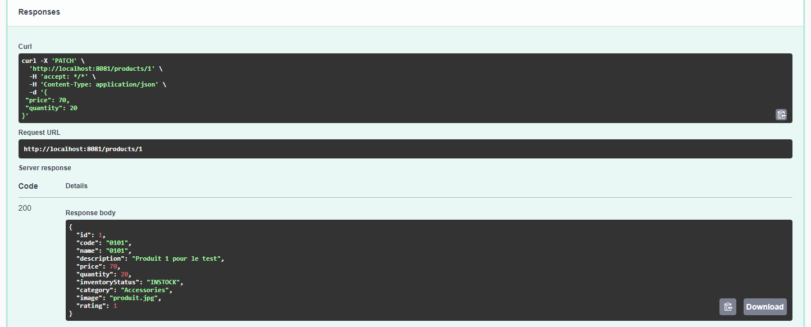
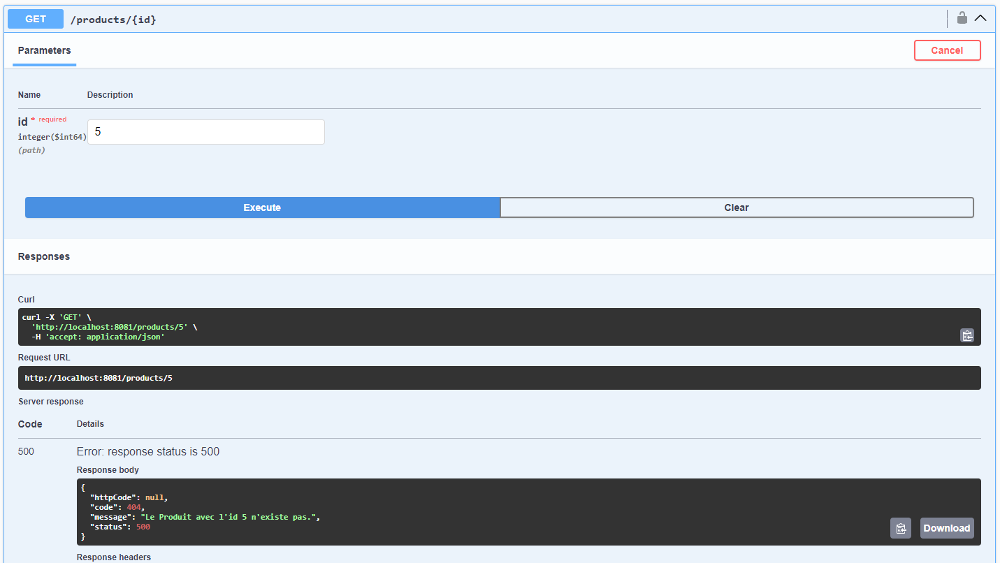

# Back-end

## Technologies Utilisés

- **Java 17 /Spring Boot**: FrameWork du développement Backend.
- **PostgresSQL**: Système de gestion de base de données.
- **Flyway**: Outil de migration de base de données.

## Migration Base de données

Flyway est utilisé pour la migration de bases de données.
Les scripts permettant de créer et de remplir la base de données peuvent être trouvés dans les chemins suivants:

- **Scripts creation des tables**: `src/main/resources/flyway/schema`
    - Contient des scripts pour créer les tables de base de données.

- **Scripts d'insertion**: `src/main/resources/flyway/all`
    - Contient des scripts pour insérer des catégories au démarrage du projet.

- ## Création de la base de données
**Ouvrir un terminal et executer les commandes suivantes** :

    psql -U postgres
    CREATE ROLE bko WITH LOGIN PASSWORD 'bko';
    CREATE DATABASE shop_product;
    \c shop_product
    ALTER SCHEMA public OWNER TO bko;


## Modèle relationnel


Le back-end gère tous les API REST suivantes :

| Resource           | POST                  | GET                            | PATCH                                    | PUT | DELETE           |
| ------------------ | --------------------- | ------------------------------ | ---------------------------------------- | --- | ---------------- |
| **/products**      | Create a new products | Retrieve all products          | X                                        | X   |     X            |
| **/products/1**    | X                     | Retrieve details for product 1 | Update details of product 1 if it exists | X   | Remove product 1 |


## Construire et exécuter l'application  (3 méthodes différentes)

## Utiliser l'IDE

1. Faites un clic droit sur la classe principale **( src\main\java\com\alten\shopproduct\ShopProductionApplication.java )** contenant la méthode `main` et sélectionnez `Run`.

## Utiliser la ligne de commande
1. **Ouvrir un terminal** :
   Naviguez jusqu'au répertoire racine du projet (là où se trouve le fichier `pom.xml`).

2. **Compiler et construire le projet** :
   ```sh
   mvn clean install

3. **Exécuter l'application** :
   ```sh
   mvn spring-boot:run

## Utiliser Docker

- Avec Docker, pas besoin de créer le rôle et la base de données.


1. **Ouvrir un terminal** :
   Naviguez jusqu'au répertoire racine du projet (là où se trouve les fichiers `Dockerfile` et `docker-compose.yml`).

2. **Builder l'image du projet back** :
   ```sh
   docker build -t shop_product .
3. **Lancer Docker Compose** :
   ```sh
   docker-compose up


Une fois que l'application est en cours d'exécution,
vous pouvez accéder avec l'URL de base ( http://localhost:8081) via un navigateur ou un outil comme Postman.
Vous pouvez y accéder par swagger egalement (http://localhost:8081/swagger-ui/index.html#`).


## Tests avec Swagger

1. **Create a new products** :





2. **Retrieve all Products**


3. **Retrieve details for product 1**


4. **Update details of product 1 if it exists**







5. **Remove product 1**


6. **Exception management (Product not found with ID)**




# Application Front

- Le front-end a été adapté pour se connecter aux api.
- vous pouvez lancer le front-end angular avec la commande 'ng serve'
- Vous devez lancer le backend en utilisant la méthode 1 (Utiliser IDE) ou méthode 2 (Utiliser la ligne de commande).
